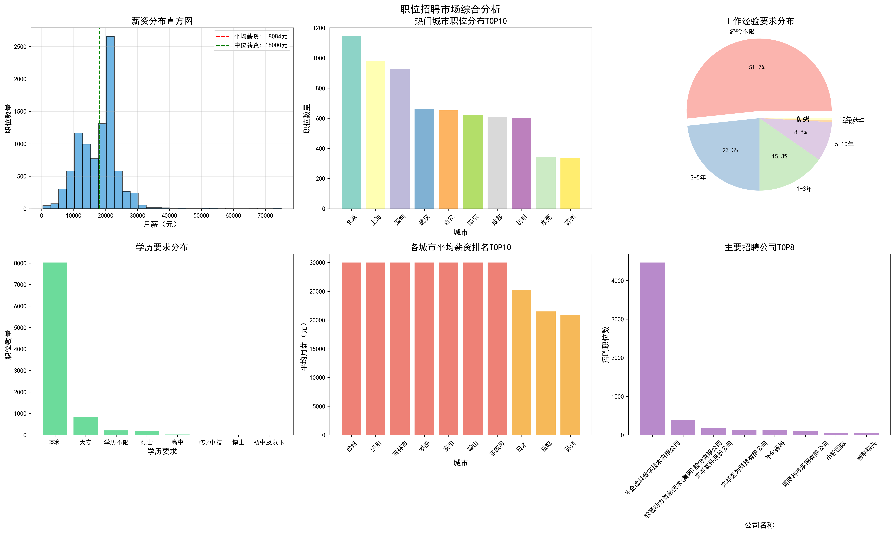
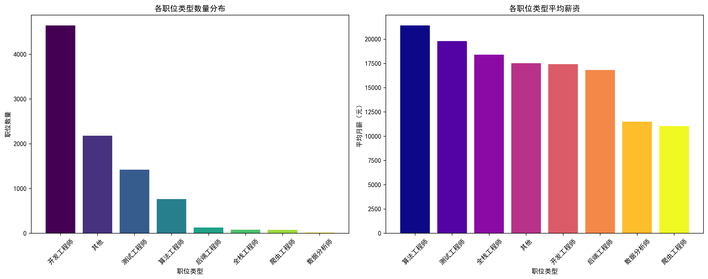
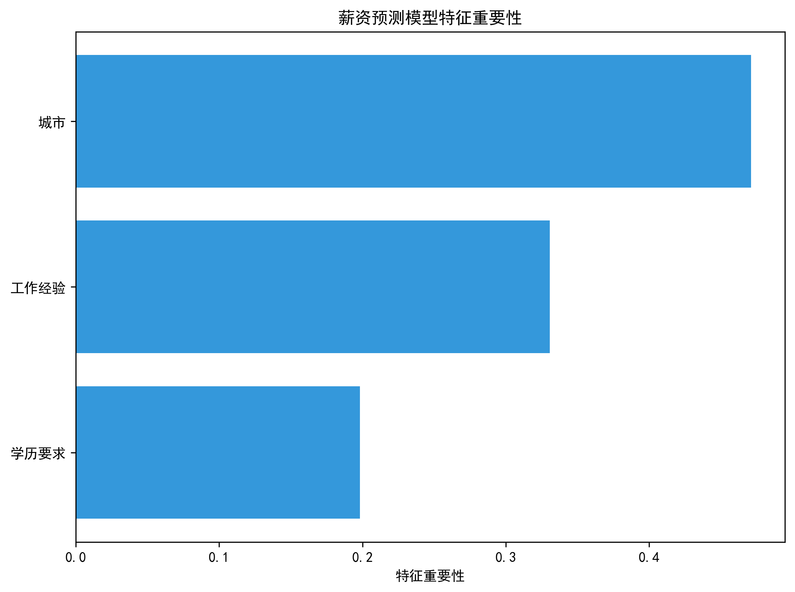
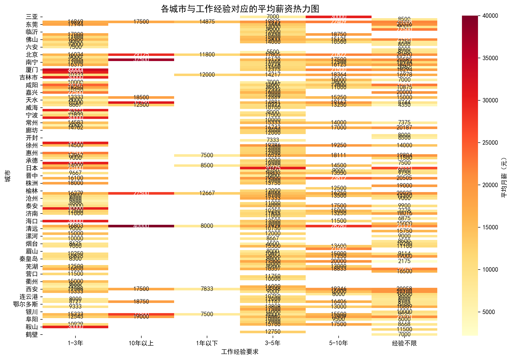
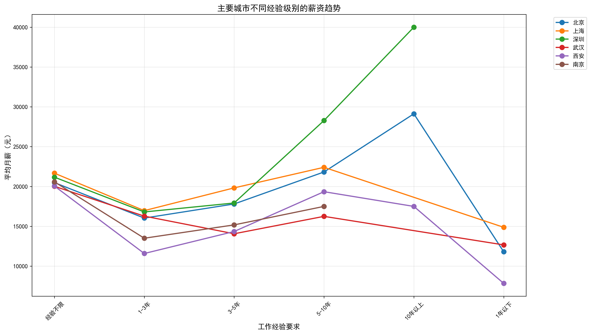
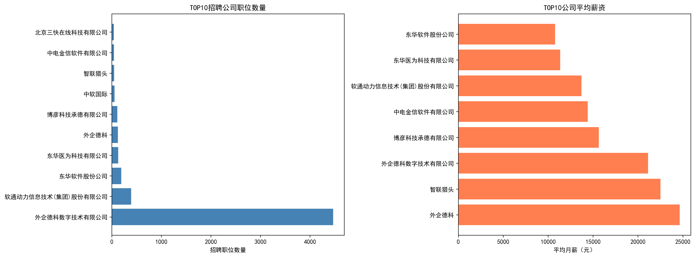

# 基于多源数据的招聘市场智能分析系统

一个基于Python的职位招聘市场数据分析模型，能够从智联招聘爬取数据，进行深度分析和可视化展示。

## 一、项目概述

本项目提供了一套完整的职位市场分析解决方案，包括数据采集、数据清洗、统计分析、机器学习建模和数据可视化等功能。系统特别针对Python相关职位进行了优化，能够帮助用户深入了解招聘市场现状和趋势。

## 二、项目特点

### 2.1. 智能数据采集
- 多技术栈关键词支持
- 智能反爬虫机制
- 自动数据去重

### 2.2. 深度智能分析  
- 多维度统计分析：城市、薪资、经验、学历
- 基于机器学习的薪资预测模型[salary_predictor.py](salary_predictor.py)
- 智能职位分类识别

### 2.3. 专业可视化
- 综合仪表板：6合1图表展示市场全貌
- 高级图表：热力图、趋势图、词云图
- 交互式探索：支持动态数据筛选

### 2.4. 实用业务价值
- 求职者：薪资参考和职业规划
- 企业：市场薪资水平分析  
- 教育机构：技能需求洞察

## 三、功能特性

### 3.1. 数据采集
- **智能爬虫**：自动从智联招聘获取职位信息
- **多关键词支持**：支持Python、Java、Go等多种技术栈
- **反爬虫处理**：包含请求延时和User-Agent模拟
- **数据保存**：自动保存为zhaopin_jobs.csv

### 3.2. 数据分析
- **数据预处理**：自动清洗和标准化薪资、经验等字段
- **统计分析**：提供关键指标统计和趋势分析
- **薪资预测**：基于随机森林和深度学习的薪资预测模型
- **特征重要性分析**：识别影响薪资的关键因素

### 3.3. 数据可视化
系统生成以下可视化图表，帮助用户从多维度理解招聘市场情况：

- **综合可视化分析.png**：多维度综合展示市场情况，包括薪资分布直方图、热门城市职位分布TOP10、工作经验要求分布饼图、学历要求分布、各城市平均薪资排名TOP10和主要招聘公司TOP8

- **职位类型分析.png**：展示各职位类型的数量分布和平均薪资对比，包括开发工程师、算法工程师、数据分析师等职位分类

- **特征重要性分析.png**：展示薪资预测模型中各特征（城市、工作经验、学历要求）的重要性排序

- **薪资热力图.png**：以热力图形式展示不同城市和工作经验组合下的平均薪资，揭示地域与经验对薪资的综合影响

- **薪资趋势图.png**：展示主要城市在不同工作经验要求下的薪资变化趋势，分析职业发展路径

- **职位关键词词云.png**：从职位名称中提取的关键词词云图，直观展示职位技能需求和市场热点

- **公司分析.png**：分析TOP10招聘公司的职位数量和平均薪资，识别主要雇主和市场格局

- **[职业市场交互图.html](plot/职业市场交互图.html)**：
交互式图表，展示各城市的职位数量和平均薪资，支持动态探索和数据筛选
这些图表全面覆盖了薪资分析、地域分布、经验要求、学历要求、职位分类、企业招聘等多个维度，为求职者和招聘方提供直观的数据洞察。

## 四、项目结构

```
job_analysis/
├── main.py                         # 主运行程序
├── data_spider.py                  # 数据采集模块
├── analysis.py                     # 数据分析模块
├── salary_predictor.py             # 薪资预测模块
├── visualization.py                # 数据可视化模块
├── requirements.txt                # 项目依赖
├── README.md                       # 项目说明
├── zhaopin_jobs.csv                # 数据文件
├── salary_predictor_model.h5       # 薪资预测模型文件
└── plot/                           # 图表输出目录
```

## 五、部署与运行

### 5.1. 环境要求
- Python 3.8+
- 依赖包见 [requirements.txt](requirements.txt)

### 5.2. 快速开始

1. **安装依赖**
```bash
  pip install -r requirements.txt
```
2. **主程序运行**
```bash
  python main.py
```

### 5.3. 模块运行
1. **数据采集**
```bash
  python data_spider.py
```

2. **模型训练**
```bash
  python salary_predictor.py
```

3. **数据分析**
```bash
  python analysis.py
```

4. **可视化展示**
```bash
  python visualization.py
```

## 六、核心功能详解

### 6.1. 数据采集模块 ([data_spider.py](data_spider.py))
- 自动爬取智联招聘职位信息
- 支持自定义搜索关键词和页数
- 自动处理反爬虫机制
- 数据去重和格式标准化

### 6.2. 数据分析模块 ([analysis.py](analysis.py))
- **数据预处理**：薪资转换、城市提取、职位分类
- **统计分析**：市场概况、地域分布、经验要求
- **预测模型**：基于城市、经验、学历的薪资预测
- **业务洞察**：生成可操作的市场建议

### 6.3. 薪资预测模块 ([salary_predictor.py](salary_predictor.py))
深度学习模型：基于TensorFlow/Keras的神经网络
特征工程：城市等级、学历编码、经验年限处理
模型优化：正则化、批归一化、Dropout防止过拟合
预测调整：根据城市、经验和学历进行薪资调整


### 6.4. 可视化模块 ([visualization.py](visualization.py))
- **基础图表**：柱状图、饼图、直方图
- **高级可视化**：热力图、趋势图、词云
- **交互功能**：动态图表、HTML输出
- **企业分析**：招聘公司排名和薪资对比

## 七、输出示例

系统将生成以下类型的分析结果：

### 7.1. 统计报告
- 市场平均薪资、职位数量
- 地域分布特征
- 人才需求分析

### 7.2. 可视化图表
- 综合分析仪表板
- 薪资热力图和趋势图
- 职位关键词词云
- 企业招聘分析

### 7.3. 预测模型
- 特征重要性排名
- 薪资预测准确率
- 自定义条件预测

---

通过该模型，您可以全面了解技术招聘市场的现状，为求职、招聘或市场研究提供数据支持。

- **2305500133邓双林**
