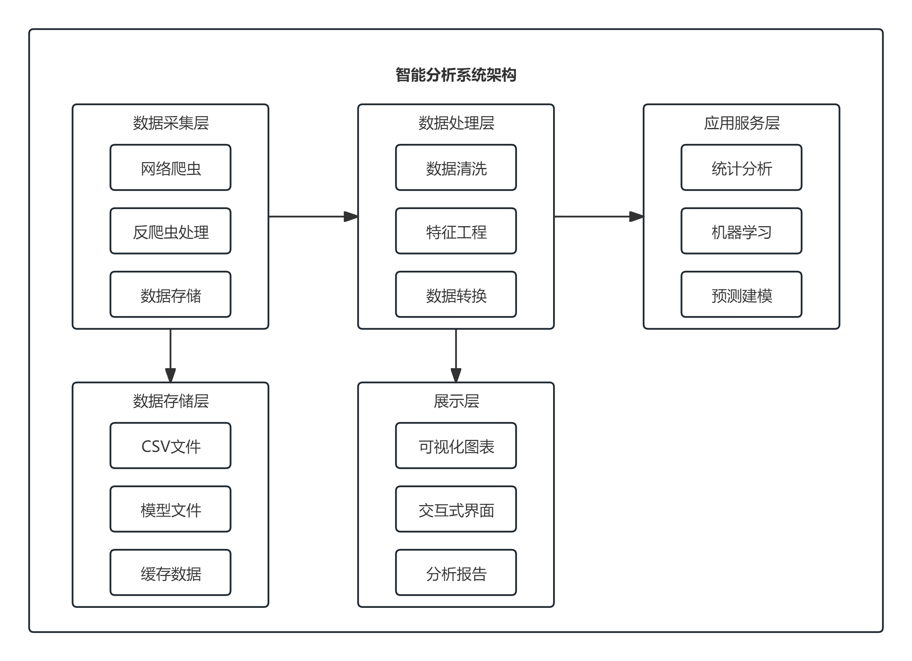

# 基于多源数据的招聘市场智能分析系统

## 项目背景

### 1.1 市场需求背景
随着互联网技术的快速发展，IT行业人才需求持续增长，但求职者和企业之间存在着信息不对称的问题。求职者难以准确了解市场薪资水平，企业也难以把握合理的薪酬标准。特别是在Python、Java、Go等热门技术领域，市场变化迅速，需要实时、准确的数据支持。

### 1.2 技术背景
传统的人工招聘数据分析方法效率低下，难以处理大规模数据。随着大数据技术和人工智能的发展，基于机器学习的智能分析系统能够自动化完成数据采集、清洗、分析和可视化，为求职者和企业提供科学决策支持。

### 1.3 学术价值
本项目结合统计学、数据科学和机器学习技术，构建了一个完整的分析框架，具有重要的学术研究价值。通过多维度数据分析和预测建模，为招聘市场研究提供了新的技术路径。

## 项目需求分析

### 2.1 功能需求

#### 2.1.1 数据采集需求
- **多源数据获取**：支持从智联招聘等主流招聘平台获取数据
- **智能爬虫**：能够自动处理反爬虫机制，确保数据采集的稳定性
- **多关键词支持**：支持Python、Java、Go、C++、JavaScript等多种技术栈
- **数据去重**：自动识别和去除重复数据

#### 2.1.2 数据处理需求
- **数据清洗**：自动处理缺失值、异常值和格式不一致问题
- **字段标准化**：统一薪资、经验、学历等关键字段的格式
- **特征工程**：提取城市等级、经验年限、学历编码等特征

#### 2.1.3 分析建模需求
- **统计分析**：提供市场概况、地域分布、经验要求等多维度分析
- **机器学习建模**：构建基于随机森林的薪资预测模型
- **模型评估**：提供MAE、R²等评估指标

#### 2.1.4 可视化需求
- **综合仪表板**：6合1图表展示市场全貌
- **高级图表**：热力图、趋势图、词云图等专业可视化
- **交互功能**：支持动态数据筛选和探索

### 2.2 性能需求
- **数据规模**：支持处理数千条招聘数据
- **响应时间**：模型预测响应时间小于1秒
- **稳定性**：系统运行稳定，错误处理机制完善

### 2.3 用户需求
- **求职者**：了解市场薪资水平，制定合理的薪资期望
- **企业HR**：掌握市场薪酬标准，制定有竞争力的薪酬策略
- **教育机构**：了解技能需求趋势，优化课程设置

## 项目详细设计

### 3.1 系统架构设计

#### 3.1.1 整体架构


### 3.2 模块设计

#### 3.2.1 数据采集模块 (data_spider.py)
**功能职责**：
- 实现网络爬虫功能，从智联招聘获取职位信息
- 处理反爬虫机制，确保数据采集的稳定性
- 支持多关键词搜索和分页爬取

**核心类**：`ZhaopinSpider`
- `__init__()`: 初始化爬虫配置
- `get_jobs()`: 获取单页职位数据
- `save_to_csv()`: 保存数据到CSV文件
- `run()`: 执行完整的爬取流程

#### 3.2.2 数据分析模块 (analysis.py)
**功能职责**：
- 数据预处理和清洗
- 多维度统计分析
- 机器学习模型构建
- 薪资预测功能

**核心类**：`Analyzer`
- `load_data()`: 加载数据文件
- `data_preprocessing()`: 数据预处理
- `process_salary()`: 薪资格式标准化
- `build_prediction_model()`: 构建预测模型
- `predict_salary()`: 薪资预测

#### 3.2.3 可视化模块 (visualization.py)
**功能职责**：
- 生成静态可视化图表
- 创建交互式可视化界面
- 输出专业分析报告

**核心类**：`DataVisualization`
- `create_all_basic_visualizations()`: 创建基础图表
- `create_all_advanced_visualizations()`: 创建高级图表
- `create_feature_importance_plot()`: 特征重要性分析

#### 3.2.4 薪资预测模块 (salary_predictor.py)
**功能职责**：
- 深度学习模型训练
- 模型优化和调参
- 模型保存和加载

### 3.3 数据库设计

#### 3.3.1 数据表结构
```csv
职位名称,公司名称,工作地点,薪资,工作经验,学历要求
```

#### 3.3.2 特征字段说明
- **薪资字段**：支持多种格式（元/天、千/月、万/月）
- **工作经验**：1-3年、3-5年、5-10年等
- **学历要求**：大专、本科、硕士、博士
- **城市信息**：从工作地点字段中提取

### 3.4 算法设计

#### 3.4.1 薪资预测算法
**模型选择**：随机森林回归模型
- **优点**：处理非线性关系，抗过拟合能力强
- **特征**：城市编码、经验编码、学历编码
- **评估指标**：MAE（平均绝对误差）、R²（决定系数）

#### 3.4.2 特征重要性分析
使用随机森林内置的特征重要性评估方法，识别影响薪资的关键因素。

## 项目实现过程中的问题与解决方案

### 4.1 数据采集阶段

#### 4.1.1 问题：网站反爬虫机制
**问题描述**：智联招聘等平台有严格的反爬虫机制，频繁访问会被封IP。

**解决方案**：
1. **请求头伪装**：使用真实的User-Agent模拟浏览器行为
2. **请求延时**：设置随机延时（3-5秒）避免频繁访问
3. **会话保持**：使用Session对象保持连接状态
4. **SSL验证禁用**：处理证书验证问题

```python
# 请求头配置
self.headers = {
    'User-Agent': 'Mozilla/5.0 (Windows NT 10.0; Win64; x64) AppleWebKit/537.36',
    'Accept': 'text/html,application/xhtml+xml,application/xml;q=0.9',
}

# 随机延时
time.sleep(3 + random.random() * 2)
```

#### 4.1.2 问题：页面结构变化
**问题描述**：招聘网站页面结构经常更新，导致选择器失效。

**解决方案**：
1. **多选择器策略**：使用正则表达式匹配多个可能的类名
2. **容错处理**：对每个元素提取进行异常捕获
3. **数据验证**：确保关键字段不为空

```python
# 使用正则表达式匹配多个类名
job_elements = soup.find_all('div', class_=re.compile(r'joblist|position'))
```

### 4.2 数据处理阶段

#### 4.2.1 问题：薪资格式多样化
**问题描述**：薪资字段格式不统一，存在"元/天"、"千/月"、"万/月"等多种格式。

**解决方案**：
1. **正则表达式提取**：使用正则匹配数字部分
2. **单位转换**：统一转换为月薪标准
3. **范围处理**：对薪资范围取平均值

```python
def process_salary(self, salary):
    if '元/天' in salary_str:
        daily_salary = float(numbers[0])
        return daily_salary * 21.75  # 转换为月薪
    elif '万' in salary_str:
        low *= 10000
        high *= 10000
```

#### 4.2.2 问题：缺失值处理
**问题描述**：部分字段存在缺失值，特别是薪资字段。

**解决方案**：
1. **面议处理**：将"面议"标记为缺失值
2. **数据过滤**：建模时只使用有薪资数据的记录
3. **统计报告**：在报告中明确标注有效数据量

### 4.3 模型构建阶段

#### 4.3.1 问题：分类变量编码
**问题描述**：城市、经验、学历等分类变量需要转换为数值型。

**解决方案**：
1. **LabelEncoder编码**：使用sklearn的LabelEncoder
2. **特征工程**：创建编码后的特征列
3. **编码映射**：保存编码器用于预测时的转换

```python
model_df['城市编码'] = self.le_city.fit_transform(model_df['城市'])
model_df['经验编码'] = self.le_exp.fit_transform(model_df['工作经验'])
```

#### 4.3.2 问题：模型过拟合
**问题描述**：数据量有限时，模型容易过拟合。

**解决方案**：
1. **随机森林参数调优**：设置合适的树数量和深度
2. **交叉验证**：使用train_test_split分割数据集
3. **评估指标**：使用MAE和R²综合评估模型性能

### 4.4 可视化阶段

#### 4.4.1 问题：图表布局优化
**问题描述**：多图表布局需要合理规划，避免重叠和混乱。

**解决方案**：
1. **子图布局**：使用plt.subplots()创建网格布局
2. **图表尺寸**：设置合适的figsize确保清晰度
3. **样式统一**：使用统一的颜色主题和字体设置

#### 4.4.2 问题：中文显示问题
**问题描述**：matplotlib默认不支持中文显示。

**解决方案**：
1. **字体设置**：指定支持中文的字体文件
2. **编码处理**：确保文件保存时使用正确编码

### 4.5 系统集成阶段

#### 4.5.1 问题：模块间数据传递
**问题描述**：各模块间需要共享处理后的数据。

**解决方案**：
1. **数据管道设计**：通过Analyzer类统一管理数据
2. **接口标准化**：定义清晰的输入输出接口
3. **错误处理**：完善的异常捕获和错误提示

#### 4.5.2 问题：依赖管理
**问题描述**：项目依赖多个第三方库，版本兼容性问题。

**解决方案**：
1. **requirements.txt**：明确记录所有依赖包和版本
2. **环境隔离**：建议使用虚拟环境
3. **版本控制**：确保关键库的版本稳定性

## 5. 项目成果与价值

### 5.1 技术成果
- 完整的招聘数据分析系统
- 基于机器学习的薪资预测模型
- 专业的数据可视化方案

### 5.2 业务价值
- 为求职者提供科学的薪资参考
- 帮助企业制定合理的薪酬策略
- 为教育机构提供技能需求洞察

### 5.3 学术贡献
- 展示了统计学在现实问题中的应用
- 提供了完整的数据科学项目范例
- 验证了机器学习在招聘市场分析中的有效性

## 6. 未来展望

### 6.1 功能扩展
- 支持更多招聘平台数据源
- 增加实时数据更新功能
- 开发Web界面和API接口

### 6.2 技术优化
- 引入更先进的深度学习模型
- 实现分布式数据采集
- 优化可视化交互体验

### 6.3 应用拓展
- 扩展到其他行业领域分析
- 开发移动端应用
- 提供个性化推荐服务

---

**项目开发者：邓双林**  
**完成时间：2025年**  
**技术栈：Python + 数据科学 + 机器学习**